# CLI source-file class diagrams

These diagrams follow the active CLI entrypoint declared by `crates/ggen-cli/src/lib.rs`. The file force-links `ggen-engine` command registrations, loads optional telemetry configuration, rewrites selected bare nouns to default verbs, and delegates execution to the clap-noun-verb registry.

## `crates/ggen-cli/src/lib.rs`

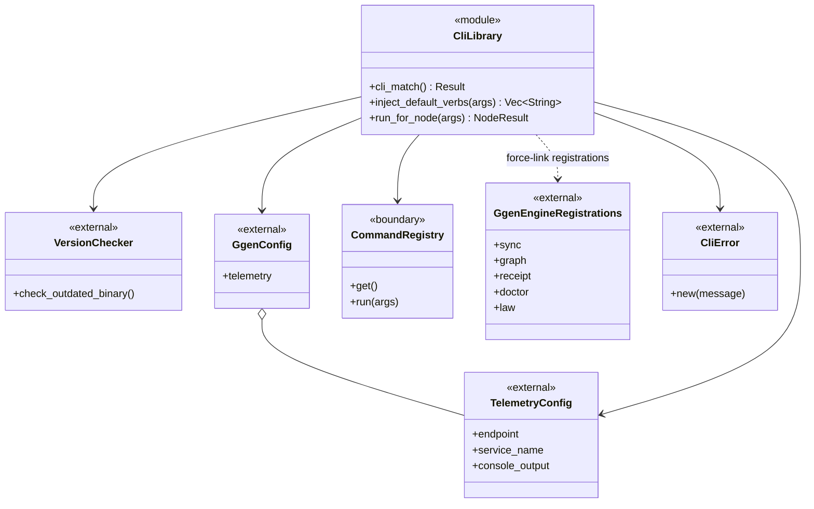

## `crates/ggen-cli/src/generated_commands.rs`

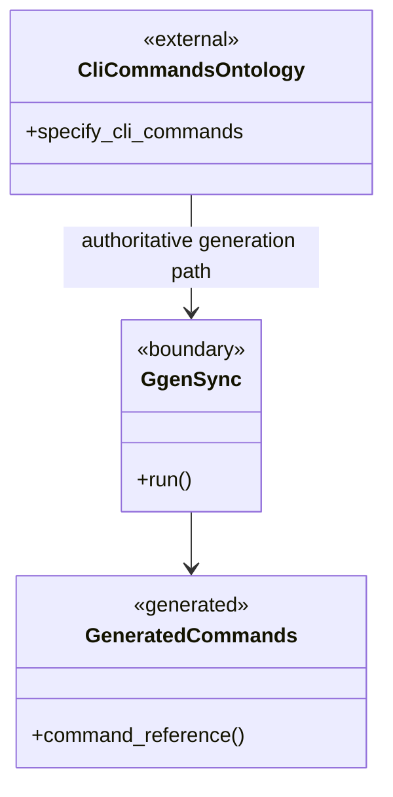

Editing authority: `.specify/cli-commands.ttl` plus the owning query/template and `ggen sync run`; this Rust file is a projection.

## `crates/ggen-cli/src/cmds/mod.rs`

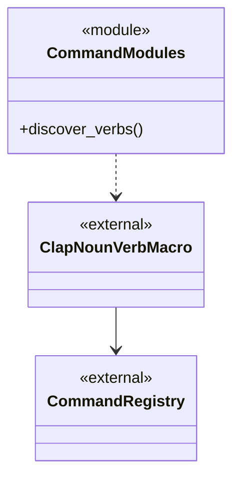

## `crates/ggen-cli/src/runtime.rs`

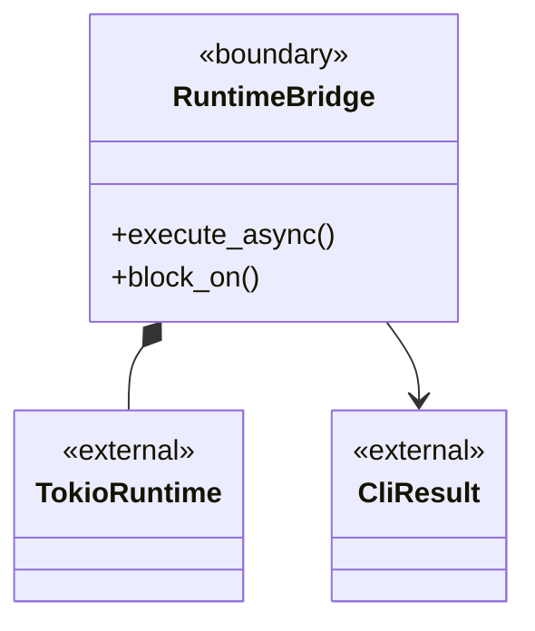

## `crates/ggen-cli/src/runtime_helper.rs`

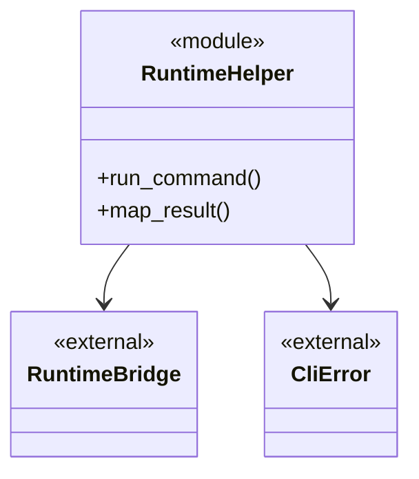

## `crates/ggen-cli/src/receipt_manager.rs`

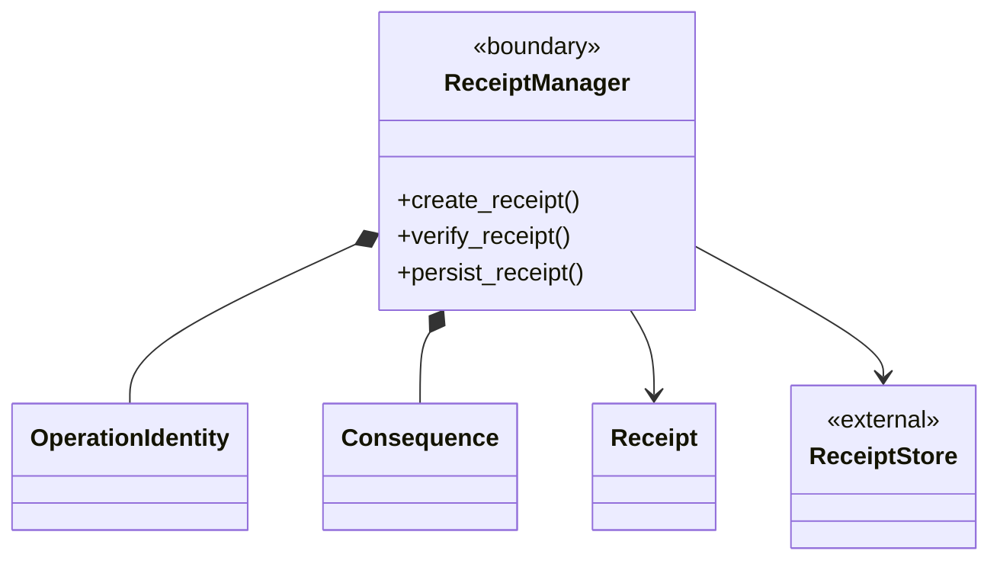

## `crates/ggen-cli/src/telemetry.rs`

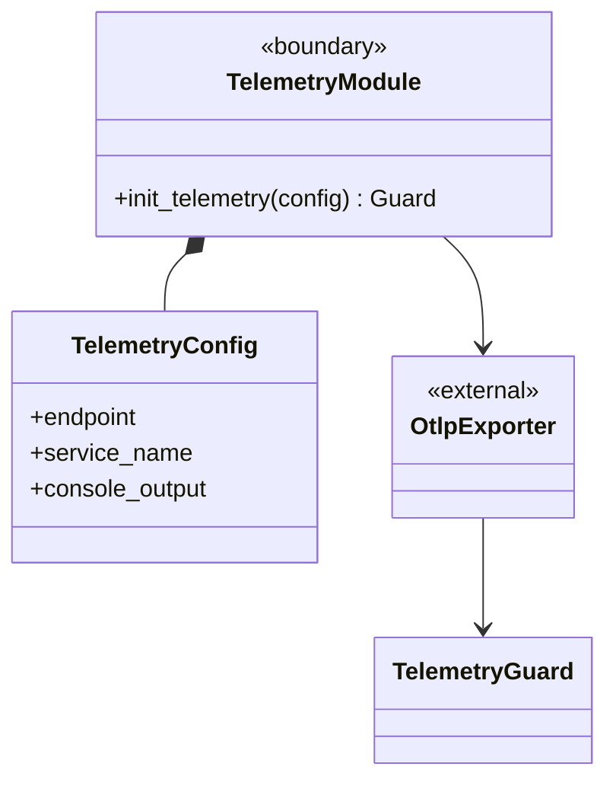

## `crates/ggen-cli/src/version_checker.rs`

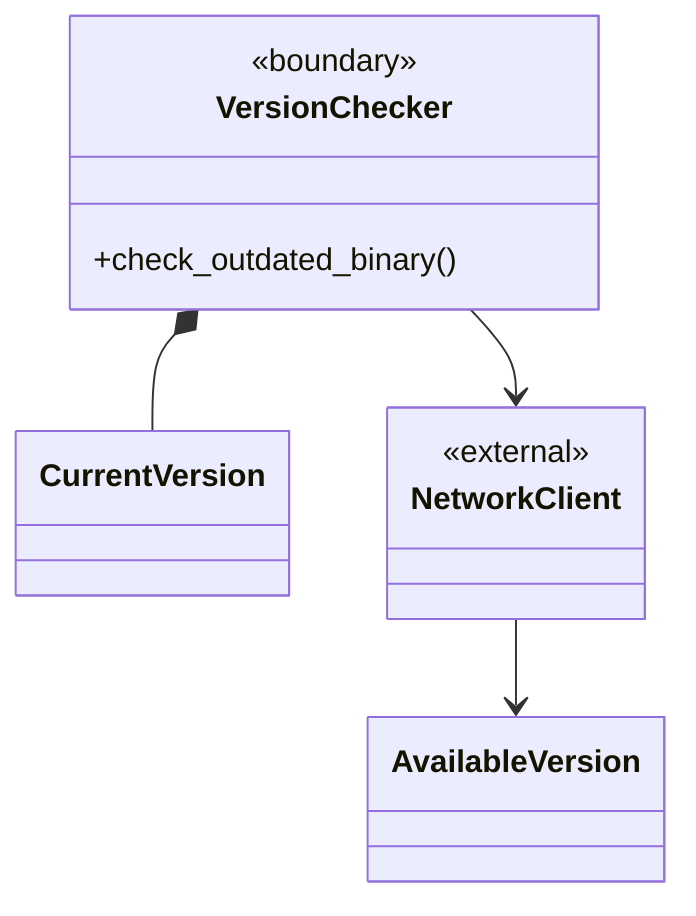

## `crates/ggen-cli/src/utils/error.rs`

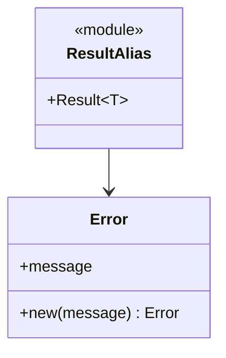

## `crates/ggen-cli/src/config_clap.rs`

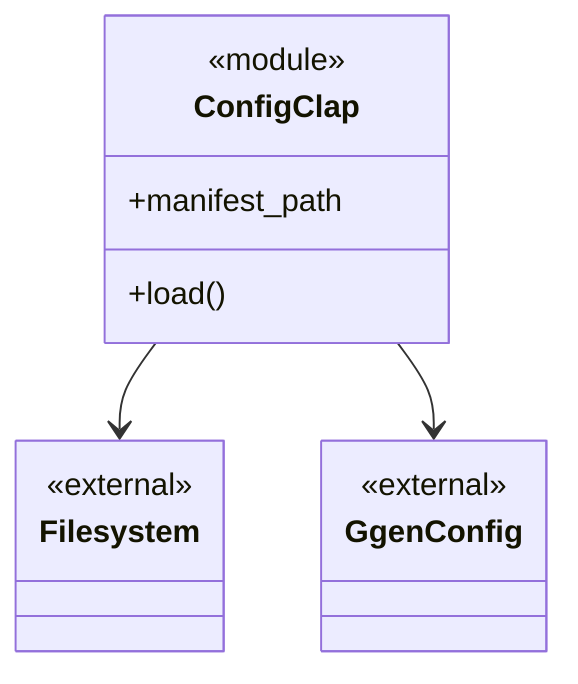

## `crates/ggen-cli/src/conventions.rs`

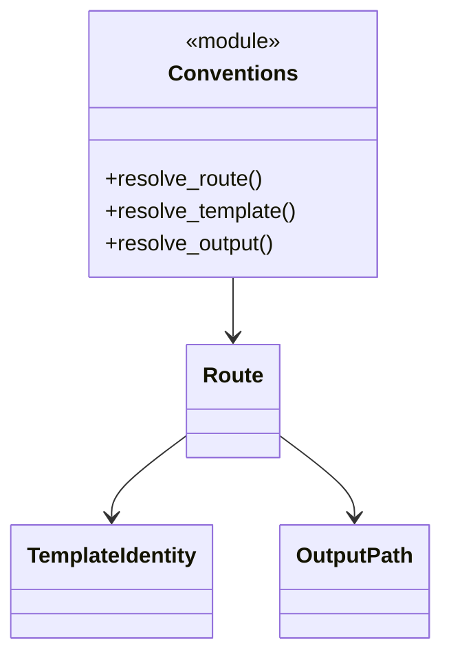

## `crates/ggen-cli/src/pack_install.rs`

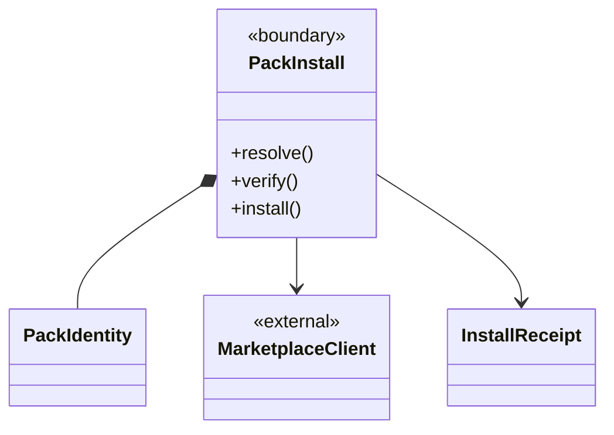

## `crates/ggen-cli/src/agent.rs`

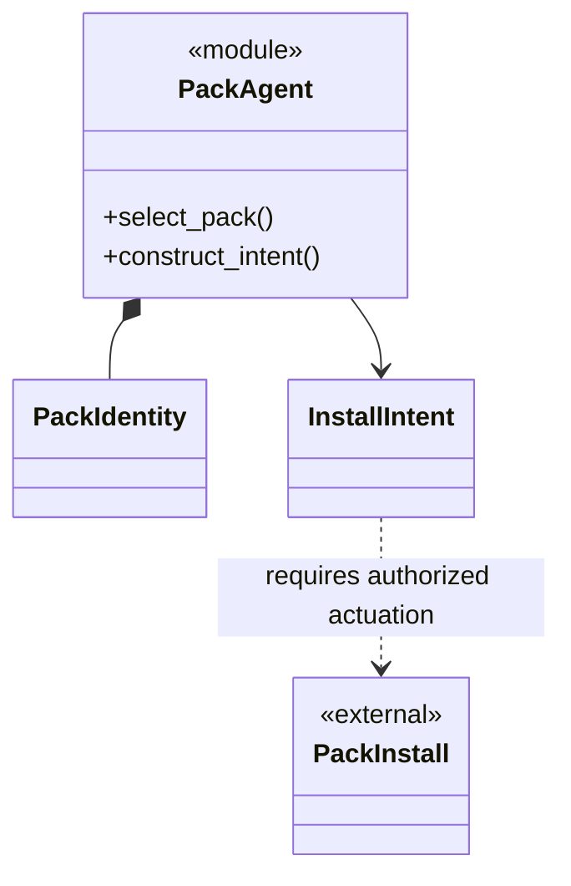

## `crates/ggen-cli/src/scaffolding.rs`

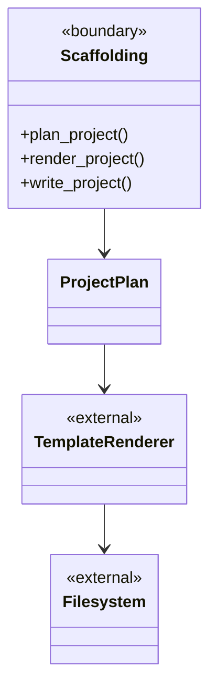

## `crates/ggen-cli/src/validation_lib.rs`

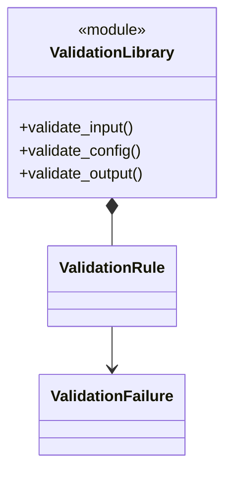

## `crates/ggen-cli/src/progress.rs`

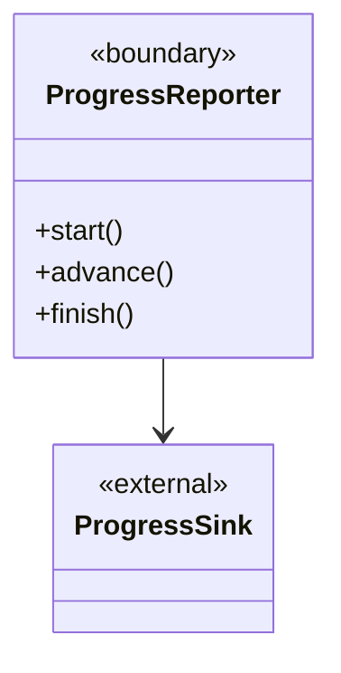

## `crates/ggen-cli/src/prelude.rs`

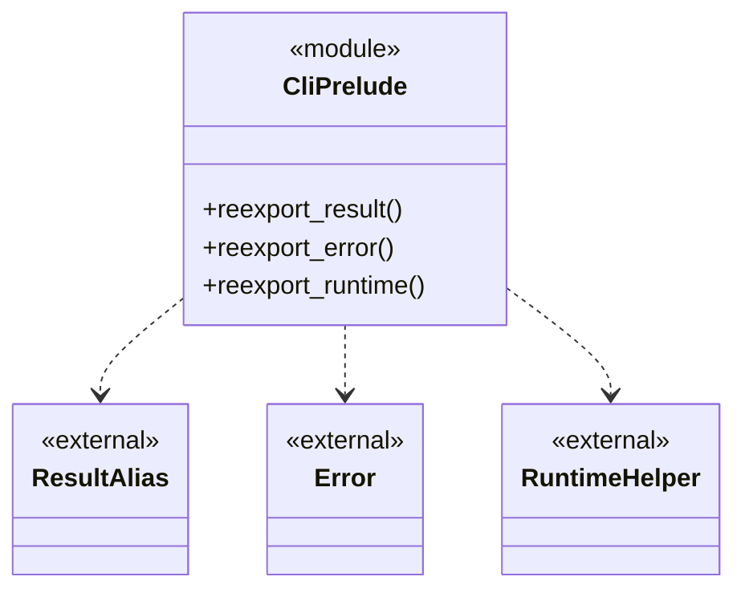

## End-to-end CLI relation

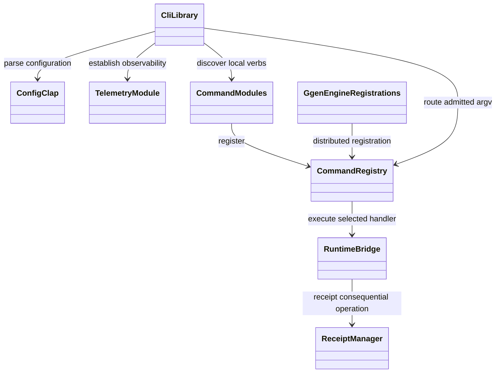

## Evidence classification

- `OBSERVED`: module declarations, generated-file authority comment, force-link to `ggen-engine`, telemetry loading, registry routing, version handling, and bare-noun rewriting in `crates/ggen-cli/src/lib.rs`.
- `INFERRED`: internal class names and member partitions for files not individually executed or fully parsed.
- `UNKNOWN`: runtime execution, protocol behavior, and receipt persistence against this commit.
