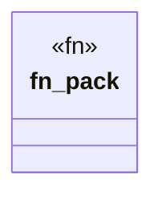

# `.specify/specs/lsp-max/examples/lsp-max-scaffold/anti-llm-cheat-lsp/src/packs/cheat_claims.rs`

Source SHA-256: `fb94a97e4e795616a9f32e279c219f6fc866ade5361381d78fbd658cde019b5b`

## Dependencies

- `lsp_max::{EvalBudget, Rule, RulePack}`

## Standing

- Structural parse: `ALIVE`
- Runtime behavior: `UNKNOWN`
