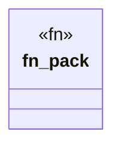

# `.specify/specs/lsp-max/examples/lsp-max-scaffold/anti-llm-cheat-lsp/src/packs/cheat_receipts.rs`

Source SHA-256: `2b1c4a98a44376e337b27d1b6c9f4924c5a3586e1d8f1c224d488c80fb026385`

## Dependencies

- `lsp_max::{EvalBudget, Rule, RulePack}`

## Standing

- Structural parse: `ALIVE`
- Runtime behavior: `UNKNOWN`
