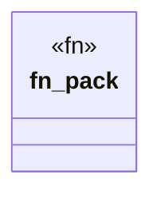

# `.specify/specs/lsp-max/examples/lsp-max-scaffold/anti-llm-cheat-lsp/src/packs/cheat_smells.rs`

Source SHA-256: `79c1f05f5d60b15bb3b69cfed81ef1444d7aa5a8f3b6c122da76441888a8ed02`

## Dependencies

- `lsp_max::{EvalBudget, Rule, RulePack}`

## Standing

- Structural parse: `ALIVE`
- Runtime behavior: `UNKNOWN`
