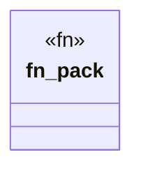

# `.specify/specs/lsp-max/examples/lsp-max-scaffold/anti-llm-cheat-lsp/src/packs/cheat_surface.rs`

Source SHA-256: `63119134aae2ed320852552346028c6cd95485f541be21d0129d1a02d30e1e87`

## Dependencies

- `lsp_max::{EvalBudget, Rule, RulePack}`

## Standing

- Structural parse: `ALIVE`
- Runtime behavior: `UNKNOWN`
