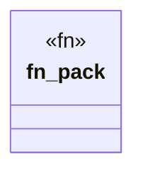

# `.specify/specs/lsp-max/examples/lsp-max-scaffold/anti-llm-cheat-lsp/src/packs/cheat_tests.rs`

Source SHA-256: `5ca025e43284a4c377c833ed5d09c0f8ad0045cc4ee566485664426977e8ed1f`

## Dependencies

- `lsp_max::{EvalBudget, Rule, RulePack}`

## Standing

- Structural parse: `ALIVE`
- Runtime behavior: `UNKNOWN`
