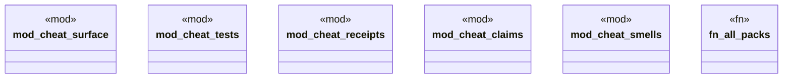

# `.specify/specs/lsp-max/examples/lsp-max-scaffold/anti-llm-cheat-lsp/src/packs/mod.rs`

Source SHA-256: `6fca445b6847ff8c184494a672c7103499002ae0d191adb2b1fd9f52cfb31db6`

## Dependencies

- `lsp_max::RulePack`

## Standing

- Structural parse: `ALIVE`
- Runtime behavior: `UNKNOWN`
