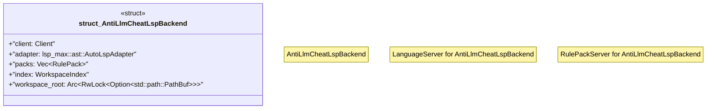

# `.specify/specs/lsp-max/examples/lsp-max-scaffold/anti-llm-cheat-lsp/src/server.rs`

Source SHA-256: `935fc114353ee4700e435a173dfef6d06e4e4edb5fe1d60dddf23adf9abd926d`

## Dependencies

- `crate::packs`
- `crate::workspace`
- `lsp_max::ast::AutoLspAdapter`
- `lsp_max::lsp_types_max::*`
- `lsp_max::rule_pack_server::{RulePack, RulePackServer, WorkspaceIndex}`
- `lsp_max::{Client, LanguageServer, LspService, Server}`
- `std::sync::Arc`
- `tokio::sync::RwLock`

## Standing

- Structural parse: `ALIVE`
- Runtime behavior: `UNKNOWN`
