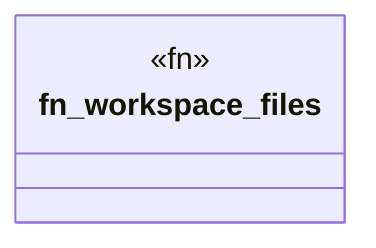

# `.specify/specs/lsp-max/examples/lsp-max-scaffold/anti-llm-cheat-lsp/src/workspace.rs`

Source SHA-256: `51492bf5f2b6adba36622e0517bca00b13a79d591e45d551f99df3e00ce50434`

## Dependencies

- `std::path::{Path, PathBuf}`

## Standing

- Structural parse: `ALIVE`
- Runtime behavior: `UNKNOWN`
