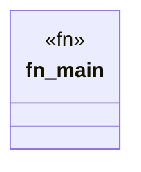

# `.specify/specs/lsp-max/examples/lsp-max-scaffold/my-lsp/build.rs`

Source SHA-256: `79e935334ef6df214dad9a1a926fbe5825b0a1c3adab82f7aadee0d92fc0c1ca`

## Dependencies

- None observed.

## Standing

- Structural parse: `ALIVE`
- Runtime behavior: `UNKNOWN`
