# `.specify/specs/lsp-max/examples/lsp-max-scaffold/my-lsp/src/main.rs`

Source SHA-256: `b12f2148a6726835060fe646a5e6d52eaca76071b8c824a099129bf9efe99aa3`

```mermaid
classDiagram
    class mod_packs {
      <<mod>>
    }
    class mod_server {
      <<mod>>
    }
    class mod_workspace {
      <<mod>>
    }
    class struct_Cli {
      <<struct>>
      +"noun: Option~Noun~"
    }
    class enum_Noun {
      <<enum>>
    }
    class struct_LspArgs {
      <<struct>>
      +"verb: LspVerb"
    }
    class enum_LspVerb {
      <<enum>>
    }
    class struct_PacksArgs {
      <<struct>>
      +"verb: PacksVerb"
    }
    class enum_PacksVerb {
      <<enum>>
    }
    class struct_CheckArgs {
      <<struct>>
      +"path: std::path::PathBuf"
    }
    class struct_WorkspaceArgs {
      <<struct>>
      +"verb: WorkspaceVerb"
    }
    class enum_WorkspaceVerb {
      <<enum>>
    }
    class struct_RulesArgs {
      <<struct>>
      +"verb: RulesVerb"
    }
    class enum_RulesVerb {
      <<enum>>
    }
    class fn_cmd_packs_list {
      <<fn>>
    }
    class fn_cmd_packs_validate {
      <<fn>>
    }
    class fn_cmd_check {
      <<fn>>
    }
    class fn_cmd_workspace_scan {
      <<fn>>
    }
    class fn_cmd_workspace_report {
      <<fn>>
    }
    class fn_cmd_workspace_globs {
      <<fn>>
    }
    class fn_cmd_rules_list {
      <<fn>>
    }
    class fn_cmd_rules_show {
      <<fn>>
    }
    class fn_scan_content {
      <<fn>>
    }
```

## Dependencies

- `clap::{Args, Parser, Subcommand}`
- `server::MyLspBackend`
- `tokio::net::TcpListener`

## Standing

- Structural parse: `ALIVE`
- Runtime behavior: `UNKNOWN`
