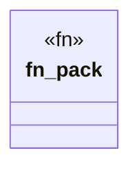

# `.specify/specs/lsp-max/examples/lsp-max-scaffold/my-lsp/src/packs/example.rs`

Source SHA-256: `009ff1007a1d65a5e8da129738fbc392874ef6a1e71512a069d9c6c91c837a1d`

## Dependencies

- `lsp_max::{EvalBudget, Rule, RulePack}`

## Standing

- Structural parse: `ALIVE`
- Runtime behavior: `UNKNOWN`
