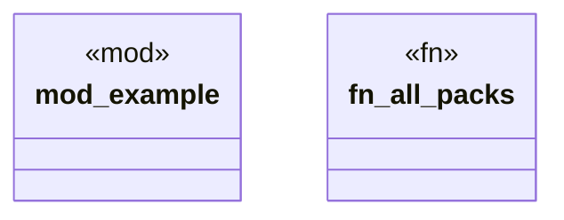

# `.specify/specs/lsp-max/examples/lsp-max-scaffold/my-lsp/src/packs/mod.rs`

Source SHA-256: `ed4870c71e339c7db9b11cd1e8c3ba685c2c0365be5b3c600a961c213578a832`

## Dependencies

- `lsp_max::RulePack`

## Standing

- Structural parse: `ALIVE`
- Runtime behavior: `UNKNOWN`
