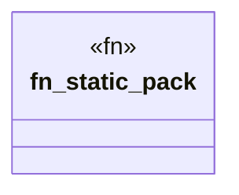

# `.specify/specs/lsp-max/examples/lsp-max-scaffold/my-lsp/src/semantics.rs`

Source SHA-256: `dd1d65b086e630eab6b655b729f45f3e00fd5154edd6b0daabecc9f098c2648f`

## Dependencies

- `lsp_max::rule_pack_server::{ CrossFileRule, EvalBudget, Rule, RulePack, RulePackSnapshot, WorkspaceIndex, }`

## Standing

- Structural parse: `ALIVE`
- Runtime behavior: `UNKNOWN`
