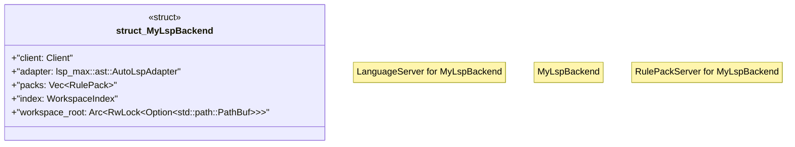

# `.specify/specs/lsp-max/examples/lsp-max-scaffold/my-lsp/src/server.rs`

Source SHA-256: `49003fa7cedbed67eb4ec786a99b56579ed57b6d09f157a91842948218087b1d`

## Dependencies

- `crate::packs`
- `crate::workspace`
- `lsp_max::ast::AutoLspAdapter`
- `lsp_max::lsp_types_max::*`
- `lsp_max::rule_pack_server::{RulePack, RulePackServer, WorkspaceIndex}`
- `lsp_max::{Client, LanguageServer, LspService, Server}`
- `std::sync::Arc`
- `tokio::sync::RwLock`

## Standing

- Structural parse: `ALIVE`
- Runtime behavior: `UNKNOWN`
