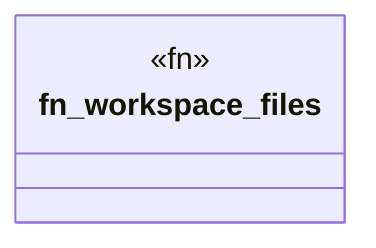

# `.specify/specs/lsp-max/examples/lsp-max-scaffold/my-lsp/src/workspace.rs`

Source SHA-256: `0e4c187af2344f27a29ecdc3476c50fa866c3a4ac41632955e4839a7253c5607`

## Dependencies

- `std::path::{Path, PathBuf}`

## Standing

- Structural parse: `ALIVE`
- Runtime behavior: `UNKNOWN`
