# `benches/a2a_bench.rs`

Source SHA-256: `77e71262a58f3f112f516347cea62039b3cc372cddb08e322860c7412a97ac97`

```mermaid
classDiagram
    class fn_bench_task_creation {
      <<fn>>
    }
    class fn_bench_task_builder {
      <<fn>>
    }
    class fn_bench_state_transition_validation {
      <<fn>>
    }
    class fn_bench_state_transition_apply {
      <<fn>>
    }
    class fn_bench_possible_transitions {
      <<fn>>
    }
    class fn_bench_task_state_checks {
      <<fn>>
    }
    class fn_bench_artifact_creation {
      <<fn>>
    }
    class fn_bench_task_serialization {
      <<fn>>
    }
    class fn_bench_task_lifecycle {
      <<fn>>
    }
    class fn_bench_batch_state_transitions {
      <<fn>>
    }
    class fn_bench_task_duration_calculation {
      <<fn>>
    }
```

## Dependencies

- `criterion::{criterion_group, criterion_main, BenchmarkId, Criterion, Throughput}`
- `ggen_lsp::a2a_mcp::a2a::{ Artifact, ArtifactContent, ArtifactType, StateTransition, Task, TaskState, TaskStateMachine, }`
- `std::hint::black_box`

## Standing

- Structural parse: `ALIVE`
- Runtime behavior: `UNKNOWN`
