# `benches/async_runtime_benchmarks.rs`

Source SHA-256: `b08d4476c0610f118ab75461b7cd3974d81d2617a0098158f1d73c52f659f5b4`

```mermaid
classDiagram
    class fn_option_a_new_runtime {
      <<fn>>
    }
    class fn_option_b_shared_runtime {
      <<fn>>
    }
    class fn_option_c_lazy_static {
      <<fn>>
    }
    class fn_bench_runtime_creation {
      <<fn>>
    }
    class fn_bench_runtime_execution {
      <<fn>>
    }
    class fn_bench_workload_types {
      <<fn>>
    }
    class fn_bench_concurrent_commands {
      <<fn>>
    }
    class fn_bench_memory_patterns {
      <<fn>>
    }
    class fn_bench_startup_latency {
      <<fn>>
    }
    class fn_bench_cli_simulation {
      <<fn>>
    }
    class fn_bench_thread_pool {
      <<fn>>
    }
```

## Dependencies

- `criterion::{criterion_group, criterion_main, BenchmarkId, Criterion, Throughput}`
- `lazy_static::lazy_static`
- `std::hint::black_box`
- `std::time::Duration`
- `tokio::runtime::{Builder, Runtime}`

## Standing

- Structural parse: `ALIVE`
- Runtime behavior: `UNKNOWN`
