# `benches/canonical_bench.rs`

Source SHA-256: `88c23b631ae0b4454d7f2ee6278a3d9d257af64bceffa0ee80b062fbdaebc758`

```mermaid
classDiagram
    class fn_bench_json_canonicalization_simple {
      <<fn>>
    }
    class fn_bench_json_canonicalization_nested {
      <<fn>>
    }
    class fn_bench_json_canonicalization_array {
      <<fn>>
    }
    class fn_bench_json_canonicalization_large {
      <<fn>>
    }
    class fn_bench_json_string_canonicalization {
      <<fn>>
    }
    class fn_bench_json_struct_canonicalization {
      <<fn>>
    }
    class fn_bench_hash_computation {
      <<fn>>
    }
    class fn_bench_json_canonicalize_and_hash {
      <<fn>>
    }
    class fn_bench_determinism_verification {
      <<fn>>
    }
    class fn_bench_pretty_vs_compact {
      <<fn>>
    }
    class fn_bench_real_world_receipt {
      <<fn>>
    }
    class fn_bench_batch_canonicalization {
      <<fn>>
    }
    class fn_bench_complex_nested_structure {
      <<fn>>
    }
```

## Dependencies

- `criterion::{criterion_group, criterion_main, BenchmarkId, Criterion, Throughput}`
- `ggen_config::canonical::Canonicalizer`
- `ggen_config::canonical::json::{canonicalize_json, canonicalize_json_str, JsonCanonicalizer}`
- `ggen_config::receipt::hash_data`
- `serde_json::{json, Value}`
- `std::hint::black_box`

## Standing

- Structural parse: `ALIVE`
- Runtime behavior: `UNKNOWN`
