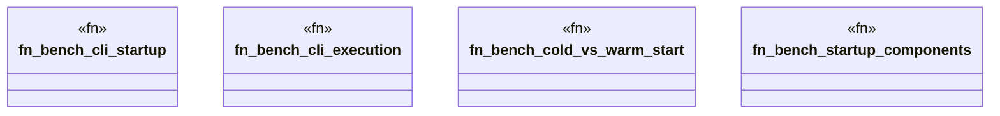

# `benches/cli_startup_performance.rs`

Source SHA-256: `56eba00c0ee93fea1c9b51eaf8b2b32638888b7c3a3127ea71bb1b59082939c0`

## Dependencies

- `criterion::{criterion_group, criterion_main, BenchmarkId, Criterion}`
- `std::hint::black_box`
- `std::process::{Command, Stdio}`
- `std::time::{Duration, Instant}`
- `tempfile::TempDir`

## Standing

- Structural parse: `ALIVE`
- Runtime behavior: `UNKNOWN`
