# `benches/comprehensive_slo_benchmarks.rs`

Source SHA-256: `97713e912493995dc5b07aafd738fd9c68eadddbc00e9f86c78c280f6ce16455`

```mermaid
classDiagram
    class mod_slo {
      <<mod>>
    }
    class fn_get_binary_path {
      <<fn>>
    }
    class fn_bench_cli_startup_slo {
      <<fn>>
    }
    class fn_create_simple_template {
      <<fn>>
    }
    class fn_create_complex_template {
      <<fn>>
    }
    class fn_bench_template_parsing_slo {
      <<fn>>
    }
    class fn_generate_test_data {
      <<fn>>
    }
    class fn_bench_json_serialization_slo {
      <<fn>>
    }
    class fn_bench_string_allocation_patterns {
      <<fn>>
    }
    class fn_bench_memory_usage_slo {
      <<fn>>
    }
    class fn_bench_e2e_workflow_slo {
      <<fn>>
    }
    class fn_bench_cache_performance_slo {
      <<fn>>
    }
```

## Dependencies

- `criterion::{criterion_group, criterion_main, BenchmarkId, Criterion, Throughput}`
- `std::collections::HashMap`
- `std::fmt::Write`
- `std::hint::black_box`
- `std::process::{Command, Stdio}`
- `std::sync::Arc`
- `std::time::Duration`

## Standing

- Structural parse: `ALIVE`
- Runtime behavior: `UNKNOWN`
