# `benches/conventions_performance.rs`

Source SHA-256: `671f6a894c4d136e92ef9690c0d8cb155477f0bdf9ff5c5aca0ed1991fc4ae1f`

```mermaid
classDiagram
    class fn_bench_discover_rdf_files {
      <<fn>>
    }
    class fn_discover_rdf_files_recursive {
      <<fn>>
    }
    class fn_setup_rdf_files {
      <<fn>>
    }
    class fn_bench_discover_templates {
      <<fn>>
    }
    class fn_discover_templates {
      <<fn>>
    }
    class fn_setup_templates {
      <<fn>>
    }
    class fn_bench_build_generation_plan {
      <<fn>>
    }
    class fn_build_generation_plan {
      <<fn>>
    }
    class fn_setup_typical_clap_project {
      <<fn>>
    }
    class fn_bench_watch_mode_latency {
      <<fn>>
    }
    class fn_setup_watch_mode_project {
      <<fn>>
    }
    class fn_bench_incremental_generation {
      <<fn>>
    }
    class fn_setup_incremental_project {
      <<fn>>
    }
    class fn_bench_full_project_generation {
      <<fn>>
    }
    class fn_setup_full_clap_project {
      <<fn>>
    }
```

## Dependencies

- `criterion::{criterion_group, criterion_main, BenchmarkId, Criterion, Throughput}`
- `std::fs`
- `std::hint::black_box`
- `std::io::Write as IoWrite`
- `std::path::{Path, PathBuf}`
- `std::time::{Duration, Instant}`
- `tempfile::TempDir`

## Standing

- Structural parse: `ALIVE`
- Runtime behavior: `UNKNOWN`
