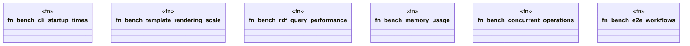

# `benches/fortune500_performance.rs`

Source SHA-256: `8b42ff679d1fe2f8d03c41f43037ba4de2d961044cf84e64a5e9efda85213549`

## Dependencies

- `criterion::{criterion_group, criterion_main, BenchmarkId, Criterion, Throughput}`
- `std::fs`
- `std::hint::black_box`
- `std::path::PathBuf`
- `std::process::Command`
- `std::time::{Duration, Instant}`
- `tempfile::TempDir`

## Standing

- Structural parse: `ALIVE`
- Runtime behavior: `UNKNOWN`
