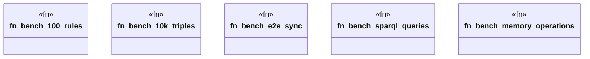

# `benches/ggen_benchmarks.rs`

Source SHA-256: `6825a253f9a6820d24da44c7f8f9c459833d5a577134f60b1a52a36602591479`

## Dependencies

- `criterion::{criterion_group, criterion_main, BenchmarkId, Criterion, Throughput}`
- `ggen_core::{ graph::Graph, validation::{RuleExecutor, RuleSeverity, ValidationRule}, }`
- `std::hint::black_box`
- `std::time::Duration`

## Standing

- Structural parse: `ALIVE`
- Runtime behavior: `UNKNOWN`
