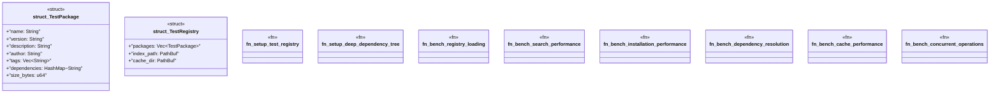

# `benches/marketplace_performance.rs`

Source SHA-256: `6f5d864447ff851ee67a986b1b1a45340207e7d1e6224ec7eaa64f56db61eef7`

## Dependencies

- `criterion::{criterion_group, criterion_main, BenchmarkId, Criterion, Throughput}`
- `serde::{Deserialize, Serialize}`
- `std::collections::HashMap`
- `std::hint::black_box`
- `std::path::PathBuf`
- `std::sync::Arc`
- `tempfile::TempDir`
- `tokio::runtime::Runtime`

## Standing

- Structural parse: `ALIVE`
- Runtime behavior: `UNKNOWN`
