# `benches/mcp_a2a_benchmarks.rs`

Source SHA-256: `c61809018e277a49603db75461f8ecbd6172bc5e65291972bcde74e31f61b50e`

```mermaid
classDiagram
    class struct_MockTool {
      <<struct>>
      +"name: String"
      +"description: String"
      +"input_schema: serde_json::Value"
      +"output_schema: serde_json::Value"
    }
    class struct_MockA2AMessage {
      <<struct>>
      +"id: String"
      +"source: String"
      +"target: Option~String~"
      +"message_type: String"
      +"payload: serde_json::Value"
      +"timestamp: u64"
    }
    class struct_MockMCPMessage {
      <<struct>>
      +"jsonrpc: String"
      +"id: Option~String~"
      +"method: Option~String~"
      +"params: Option~serde_json::Value~"
      +"result: Option~serde_json::Value~"
      +"error: Option~serde_json::Value~"
    }
    class fn_generate_mock_tools {
      <<fn>>
    }
    class fn_generate_mock_a2a_message {
      <<fn>>
    }
    class fn_generate_mock_mcp_message {
      <<fn>>
    }
    class fn_small_payload {
      <<fn>>
    }
    class fn_medium_payload {
      <<fn>>
    }
    class fn_large_payload {
      <<fn>>
    }
    class fn_bench_tool_discovery {
      <<fn>>
    }
    class fn_validate_input_schema {
      <<fn>>
    }
    class fn_bench_message_translation {
      <<fn>>
    }
    class fn_convert_a2a_to_mcp {
      <<fn>>
    }
    class fn_convert_mcp_to_a2a {
      <<fn>>
    }
    class fn_bench_tool_execution {
      <<fn>>
    }
    class fn_invoke_tool {
      <<fn>>
    }
    class fn_parse_parameters {
      <<fn>>
    }
    class fn_generate_response {
      <<fn>>
    }
    class fn_generate_error_response {
      <<fn>>
    }
    class fn_format_streaming_chunk {
      <<fn>>
    }
    class fn_bench_concurrent_operations {
      <<fn>>
    }
    class fn_process_message_concurrently {
      <<fn>>
    }
    class fn_bench_memory_usage {
      <<fn>>
    }
    class struct_MockConnectionState {
      <<struct>>
      +"id: String"
      +"connected_at: u64"
      +"tools: Vec~String~"
      +"pending_requests: Vec~String~"
      +"capabilities: Vec~String~"
    }
    class fn_estimate_tool_memory {
      <<fn>>
    }
    class struct_MockMessageBuffer {
      <<struct>>
      +"messages: Vec~MockA2AMessage~"
      +"capacity: usize"
    }
    class struct_MockCacheEntry {
      <<struct>>
      +"key: String"
      +"value: serde_json::Value"
      +"timestamp: u64"
      +"ttl: Option~u64~"
    }
    class fn_validate_tool_discovery_slo {
      <<fn>>
    }
    class fn_validate_message_translation_slo {
      <<fn>>
    }
    class fn_validate_tool_execution_slo {
      <<fn>>
    }
    class fn_validate_concurrent_slo {
      <<fn>>
    }
    class fn_validate_connection_memory_slo {
      <<fn>>
    }
    class fn_validate_tool_memory_slo {
      <<fn>>
    }
    note "MockCacheEntry"
    note "MockConnectionState"
    note "MockMessageBuffer"
```

## Dependencies

- `criterion::{criterion_group, criterion_main, BatchSize, BenchmarkId, Criterion, Throughput}`
- `std::collections::HashMap`
- `std::hint::black_box`
- `std::sync::Arc`
- `std::time::Duration`
- `tokio::sync::RwLock`

## Standing

- Structural parse: `ALIVE`
- Runtime behavior: `UNKNOWN`
