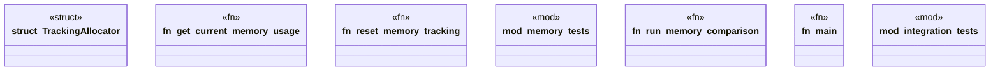

# `benches/memory_profiling.rs`

Source SHA-256: `e92d4abd1b625f54be96f861839dcd8cf6998223f7d23fb3e9b263a01aef09e9`

## Dependencies

- `lazy_static::lazy_static`
- `std::alloc::{GlobalAlloc, Layout, System}`
- `std::sync::atomic::{AtomicUsize, Ordering}`
- `super::*`
- `tokio::runtime::{Builder, Runtime}`

## Standing

- Structural parse: `ALIVE`
- Runtime behavior: `UNKNOWN`
