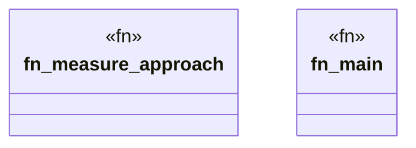

# `benches/quick_runtime_validation.rs`

Source SHA-256: `3391ecdabe878fc51047ecf644431129d32555ae670f5e04595bcd44b3fae0f6`

## Dependencies

- `lazy_static::lazy_static`
- `std::time::{Duration, Instant}`
- `tokio::runtime::{Builder, Runtime}`

## Standing

- Structural parse: `ALIVE`
- Runtime behavior: `UNKNOWN`
