# `benches/receipt_bench.rs`

Source SHA-256: `2ff6a0e2aedd60ccf5b6f0a99bf2dd3f3ce45353ba380eadde6bfe57e95f365a`

```mermaid
classDiagram
    class fn_bench_keypair_generation {
      <<fn>>
    }
    class fn_bench_receipt_creation {
      <<fn>>
    }
    class fn_bench_receipt_signing {
      <<fn>>
    }
    class fn_bench_receipt_verification {
      <<fn>>
    }
    class fn_bench_receipt_hashing {
      <<fn>>
    }
    class fn_bench_receipt_chaining {
      <<fn>>
    }
    class fn_bench_chain_building {
      <<fn>>
    }
    class fn_bench_chain_verification {
      <<fn>>
    }
    class fn_bench_data_hashing {
      <<fn>>
    }
```

## Dependencies

- `criterion::{black_box, criterion_group, criterion_main, BenchmarkId, Criterion, Throughput}`
- `ggen_config::{generate_keypair, hash_data, Receipt, ReceiptChain}`

## Standing

- Structural parse: `ALIVE`
- Runtime behavior: `UNKNOWN`
