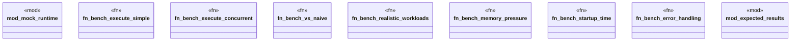

# `benches/runtime_overhead.rs`

Source SHA-256: `e18580b6209578b61918ba5d3607d8c779acaefd0335b8ca2026bce4ea2f9f66`

## Dependencies

- `criterion::{criterion_group, criterion_main, BenchmarkId, Criterion}`
- `once_cell::sync::Lazy`
- `std::future::Future`
- `std::hint::black_box`
- `std::sync::Arc`
- `std::sync::atomic::{AtomicUsize, Ordering}`
- `tokio::runtime::Runtime`

## Standing

- Structural parse: `ALIVE`
- Runtime behavior: `UNKNOWN`
