# `benches/schema_layer_slo.rs`

Source SHA-256: `b5d1027d03b4518ffe8489092a5281c5332e37083603311f068438574a138d9e`

```mermaid
classDiagram
    class mod_slo_targets {
      <<mod>>
    }
    class fn_generate_ttl_shapes {
      <<fn>>
    }
    class struct_BenchSignature {
      <<struct>>
      +"name: String"
      +"inputs: Vec~BenchField~"
      +"outputs: Vec~BenchField~"
    }
    class struct_BenchField {
      <<struct>>
      +"name: String"
      +"description: String"
      +"field_type: String"
      +"required: bool"
    }
    class fn_generate_json_schema {
      <<fn>>
    }
    class fn_generate_test_json {
      <<fn>>
    }
    class fn_transpile_ttl_to_signature {
      <<fn>>
    }
    class fn_validate_json {
      <<fn>>
    }
    class fn_transpiler_performance {
      <<fn>>
    }
    class fn_schema_generation_performance {
      <<fn>>
    }
    class fn_validation_performance {
      <<fn>>
    }
    class fn_full_pipeline_performance {
      <<fn>>
    }
    class fn_cache_effectiveness {
      <<fn>>
    }
    class fn_constraint_overhead {
      <<fn>>
    }
    class fn_slo_compliance_check {
      <<fn>>
    }
    note "BenchField"
    note "BenchSignature"
```

## Dependencies

- `criterion::{criterion_group, criterion_main, BenchmarkId, Criterion}`
- `serde_json::json`
- `std::collections::BTreeMap`
- `std::time::Duration`
- `std::time::{Duration, Instant}`

## Standing

- Structural parse: `ALIVE`
- Runtime behavior: `UNKNOWN`
