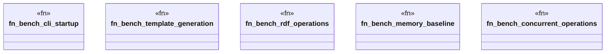

# `benches/v2_performance.rs`

Source SHA-256: `ca33e8aa356d6ab7a29553088c84a12d5708cfc4bc56f3766648522c0a8170f2`

## Dependencies

- `criterion::{criterion_group, criterion_main, BenchmarkId, Criterion}`
- `std::fs`
- `std::hint::black_box`
- `std::path::PathBuf`
- `std::process::Command`
- `tempfile::TempDir`

## Standing

- Structural parse: `ALIVE`
- Runtime behavior: `UNKNOWN`
