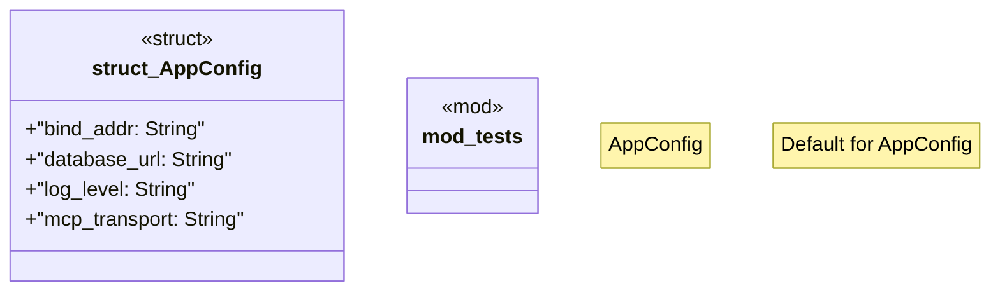

# `boilerplate/crates/config/src/lib.rs`

Source SHA-256: `1f218a8ad18a4e613d9de75a404900ebb01c9b048025312a0b0d5797b09d5dc8`

## Dependencies

- `anyhow::Result`
- `serde::{Deserialize, Serialize}`
- `std::env`
- `super::*`

## Standing

- Structural parse: `ALIVE`
- Runtime behavior: `UNKNOWN`
