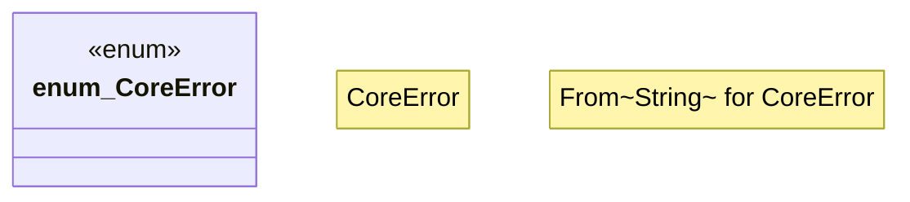

# `boilerplate/crates/core/src/error.rs`

Source SHA-256: `a2a7f3e58cc40f475532aea7299afff1a96212155f9de6b985106b0d10f09ddb`

## Dependencies

- `thiserror::Error`

## Standing

- Structural parse: `ALIVE`
- Runtime behavior: `UNKNOWN`
