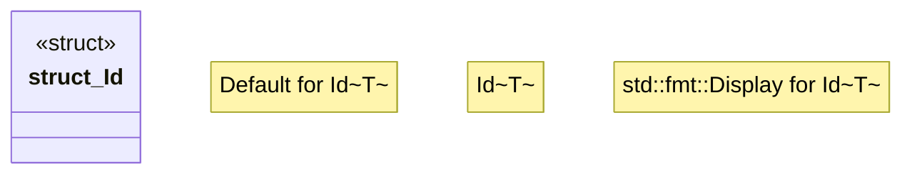

# `boilerplate/crates/core/src/id.rs`

Source SHA-256: `3f3d199f34b31c8b68d55b32151bfabbec54fcd01f3bf1fe1ba91e18069116e4`

## Dependencies

- `serde::{Deserialize, Serialize}`
- `uuid::Uuid`

## Standing

- Structural parse: `ALIVE`
- Runtime behavior: `UNKNOWN`
