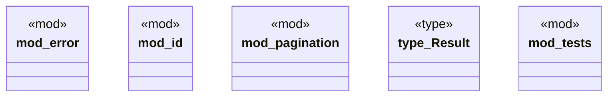

# `boilerplate/crates/core/src/lib.rs`

Source SHA-256: `1b6724166317281737423d7bdd0dd8e0bc9e625a85cd341792148478b6690f78`

## Dependencies

- `crate::id::Id`
- `crate::pagination::{Page, PagedResult}`
- `error::CoreError`
- `pagination::{Cursor, CursorPage, CursorPagedResult, Page, PagedResult}`
- `super::*`

## Standing

- Structural parse: `ALIVE`
- Runtime behavior: `UNKNOWN`
