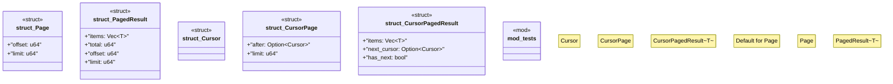

# `boilerplate/crates/core/src/pagination.rs`

Source SHA-256: `d2930f98860c8eb382605e197cc85a46fe8a7cc93abdf6ea39dcc5cdb04af8c4`

## Dependencies

- `crate::{CoreError, Result}`
- `proptest::prelude::*`
- `serde::{Deserialize, Serialize}`
- `std::fmt::Write as _`
- `super::*`

## Standing

- Structural parse: `ALIVE`
- Runtime behavior: `UNKNOWN`
