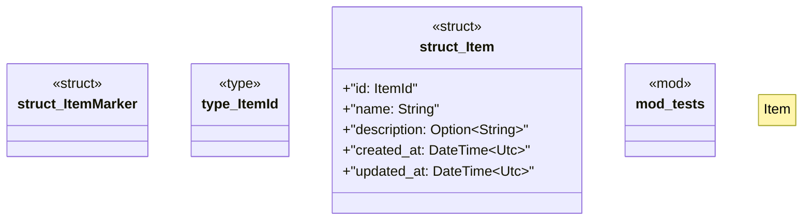

# `boilerplate/crates/domain/src/entities.rs`

Source SHA-256: `1608c04494df282fb24068bc698eb2a7fd6c2bbb4256269978694ffdfde4a9a2`

## Dependencies

- `bp_core::id::Id`
- `chrono::{DateTime, Utc}`
- `serde::{Deserialize, Serialize}`
- `super::*`

## Standing

- Structural parse: `ALIVE`
- Runtime behavior: `UNKNOWN`
