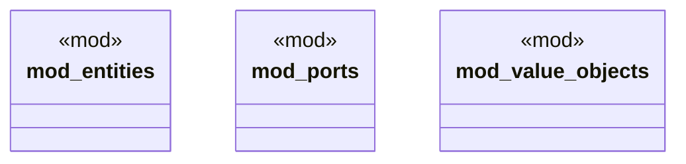

# `boilerplate/crates/domain/src/lib.rs`

Source SHA-256: `7450e34f516051cb84a16fb24d8111e24104c80068bed959d4202e1fcc835c5e`

## Dependencies

- None observed.

## Standing

- Structural parse: `ALIVE`
- Runtime behavior: `UNKNOWN`
