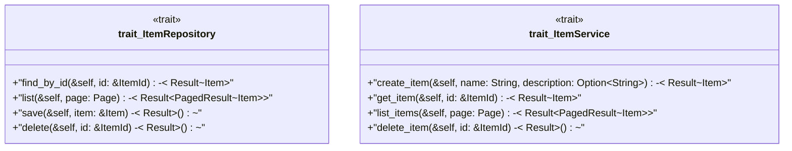

# `boilerplate/crates/domain/src/ports.rs`

Source SHA-256: `abd85e8327420db9df6522258a325ca2c7281d8beaf0ef8944d2264bc73cdb64`

## Dependencies

- `async_trait::async_trait`
- `bp_core::{ pagination::{Page, PagedResult}, Result, }`
- `crate::entities::{Item, ItemId}`

## Standing

- Structural parse: `ALIVE`
- Runtime behavior: `UNKNOWN`
