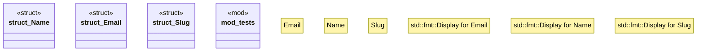

# `boilerplate/crates/domain/src/value_objects.rs`

Source SHA-256: `5e3c122831d4fd5239bc96426de0de116d1bed3af8d98629233bcef640a02088`

## Dependencies

- `bp_core::{error::CoreError, Result}`
- `proptest::prelude::*`
- `super::*`

## Standing

- Structural parse: `ALIVE`
- Runtime behavior: `UNKNOWN`
