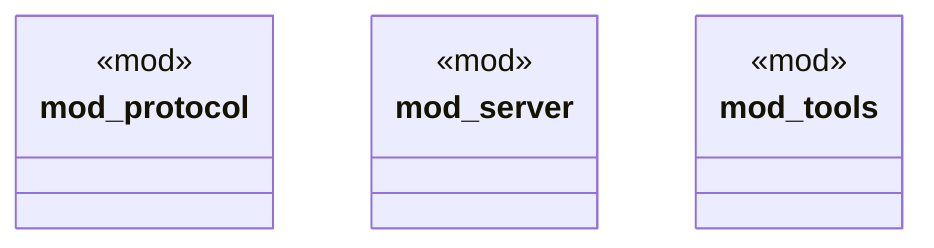

# `boilerplate/crates/mcp-server/src/lib.rs`

Source SHA-256: `46c02a1a5ae08bbab092bf46a91bac54b45fa86926a848d0617d3b5dc069e408`

## Dependencies

- `bp_core as _`
- `domain as _`
- `server::McpServer`

## Standing

- Structural parse: `ALIVE`
- Runtime behavior: `UNKNOWN`
