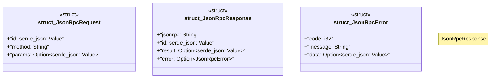

# `boilerplate/crates/mcp-server/src/protocol.rs`

Source SHA-256: `dd752ced7c74c7b91761ed331d7ede55e476e5fe9956173977886151441fd0d0`

## Dependencies

- `serde::{Deserialize, Serialize}`

## Standing

- Structural parse: `ALIVE`
- Runtime behavior: `UNKNOWN`
