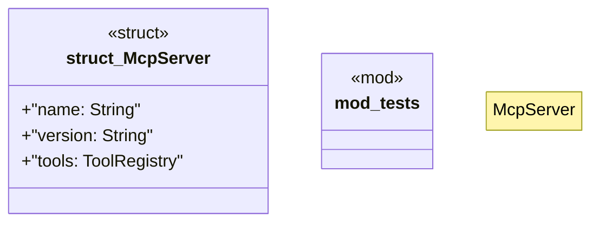

# `boilerplate/crates/mcp-server/src/server.rs`

Source SHA-256: `0a9616ee04f81d9a600cd4ff2a1a4f9ef6cc14aec0465bff6245b155d18b1f17`

## Dependencies

- `crate::protocol::JsonRpcRequest`
- `crate::{ protocol::{JsonRpcRequest, JsonRpcResponse}, tools::ToolRegistry, }`
- `serde_json::json`
- `serde_json::{json, Value}`
- `super::*`

## Standing

- Structural parse: `ALIVE`
- Runtime behavior: `UNKNOWN`
