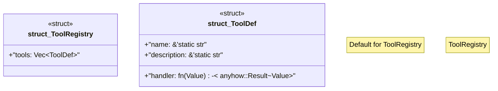

# `boilerplate/crates/mcp-server/src/tools.rs`

Source SHA-256: `cde361153b45e91df56901681e66788f06e6c91cefa099020a442d063b98c350`

## Dependencies

- `serde_json::{json, Value}`

## Standing

- Structural parse: `ALIVE`
- Runtime behavior: `UNKNOWN`
