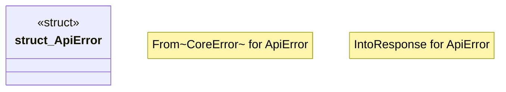

# `boilerplate/crates/service/src/error.rs`

Source SHA-256: `a055ed92be7d85658e296b70eb838cea69a7c54a13322e4420789a8643e1291d`

## Dependencies

- `axum::{ http::StatusCode, response::{IntoResponse, Response}, Json, }`
- `bp_core::CoreError`
- `serde_json::json`

## Standing

- Structural parse: `ALIVE`
- Runtime behavior: `UNKNOWN`
