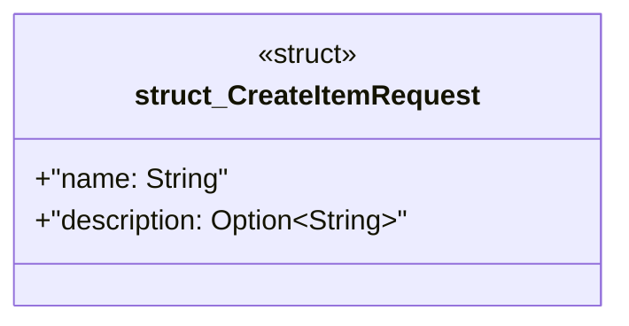

# `boilerplate/crates/service/src/handlers.rs`

Source SHA-256: `dee40cc4c2272c69424288dbf8cc3e83dcd96b0f8748796456591bc8a0df3928`

## Dependencies

- `axum::{extract::Path, Json}`
- `crate::ApiError`
- `domain::entities::{Item, ItemId}`
- `serde::Deserialize`

## Standing

- Structural parse: `ALIVE`
- Runtime behavior: `UNKNOWN`
