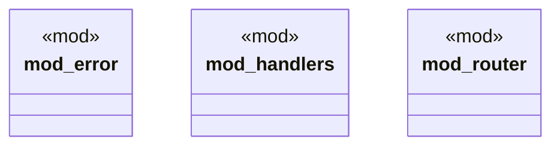

# `boilerplate/crates/service/src/lib.rs`

Source SHA-256: `4264a7f5db29e75527a9a99b4998d4e83250bdc4fecee4877dee9d42ca94187e`

## Dependencies

- `error::ApiError`

## Standing

- Structural parse: `ALIVE`
- Runtime behavior: `UNKNOWN`
