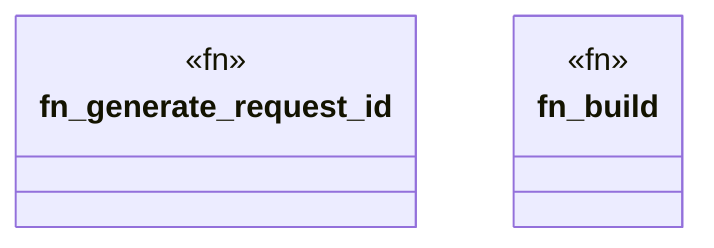

# `boilerplate/crates/service/src/router.rs`

Source SHA-256: `7d9461c612e3927c1c2cf03deb9763cbb245b57bd0327f96fb95e46317e62392`

## Dependencies

- `axum::{ extract::Request, middleware::Next, response::IntoResponse, routing::{get, post}, Router, }`
- `crate::handlers`
- `std::sync::atomic::{AtomicU64, Ordering}`
- `std::time::{SystemTime, UNIX_EPOCH}`
- `tower_http::{cors::CorsLayer, trace::TraceLayer}`

## Standing

- Structural parse: `ALIVE`
- Runtime behavior: `UNKNOWN`
