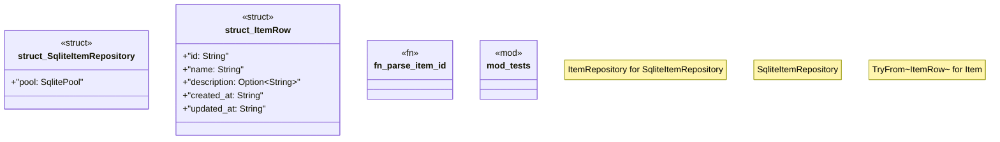

# `boilerplate/crates/sqlite/src/item_repo.rs`

Source SHA-256: `cf52025e3c1feab358ccd081a21a094d9016e39aa80f640adaa43d1bd0bd4fe9`

## Dependencies

- `anyhow::anyhow`
- `async_trait::async_trait`
- `bp_core::pagination::Page`
- `bp_core::{ pagination::{Page, PagedResult}, Result, }`
- `chrono::{DateTime, Utc}`
- `domain::{ entities::{Item, ItemId}, ports::ItemRepository, }`
- `sqlx::sqlite::SqlitePoolOptions`
- `sqlx::{FromRow, SqlitePool}`
- `super::*`

## Standing

- Structural parse: `ALIVE`
- Runtime behavior: `UNKNOWN`
